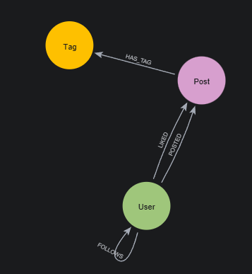
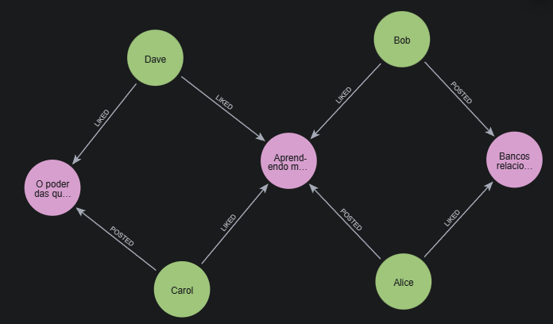
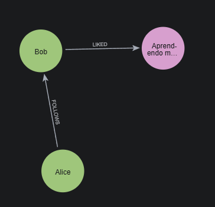
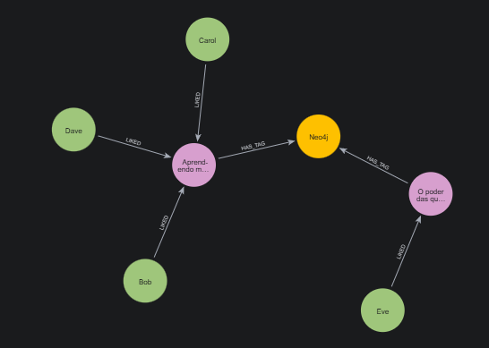

# 📊 Social Graph Analytics - Neo4j Prototype

## 1. Contexto do Problema
Uma startup de análise de mídias sociais precisa de um novo produto para oferecer *insights* sobre o engajamento e as conexões entre usuários em sua plataforma. O objetivo deste projeto é construir um protótipo funcional de banco de dados em grafos capaz de responder a perguntas complexas sobre:
* Interações entre usuários.
* Popularidade de conteúdo.
* Descoberta de comunidades de interesse.

### Por que utilizar Grafos (Neo4j)?
Bancos de dados relacionais (SQL) sofrem com problemas de performance ao realizar consultas altamente conectadas (ex: "amigos de amigos que curtiram a mesma publicação"), exigindo múltiplos `JOINs` custosos. O modelo de grafos foi escolhido porque as redes sociais são, por natureza, grafos. Representar usuários, posts e tags como **Nós** e suas interações como **Relacionamentos** permite travessias profundas em milissegundos, tornando a análise de comunidades e recomendações muito mais eficiente e intuitiva.

---

## 2. Modelo do Grafo (Schema)

Abaixo está a representação visual da modelagem do nosso banco de dados em grafos, descrevendo as entidades e como elas se relacionam.



**Estrutura Lógica:**
* **Nós (Labels):** * `User` (Propriedades: `id`, `username`, `name`)
  * `Post` (Propriedades: `id`, `content`, `date`)
  * `Tag` (Propriedades: `name`)
* **Relacionamentos:**
  * `(User)-[:FOLLOWS]->(User)`
  * `(User)-[:POSTED]->(Post)`
  * `(User)-[:LIKED]->(Post)`
  * `(Post)-[:HAS_TAG]->(Tag)`

---

## 3. Preparação e Scripts de Carga

Para garantir a reprodutibilidade do protótipo, os scripts abaixo preparam o ambiente, garantem a integridade dos dados e realizam a carga inicial.

### 3.1. Limpeza e Constraints
Antes de carregar os dados, limpamos a base e aplicamos **Constraints** para garantir a unicidade dos nós (evitando duplicidades) e otimizar as buscas através da criação automática de índices.

```cypher
// Limpeza inicial do banco
MATCH (n) DETACH DELETE n;

// Criação de Constraints de Unicidade
CREATE CONSTRAINT user_id IF NOT EXISTS FOR (u:User) REQUIRE u.id IS UNIQUE;
CREATE CONSTRAINT post_id IF NOT EXISTS FOR (p:Post) REQUIRE p.id IS UNIQUE;
CREATE CONSTRAINT tag_name IF NOT EXISTS FOR (t:Tag) REQUIRE t.name IS UNIQUE;
```
### 3.2. Dataset (Carga Inicial)
Script unificado utilizando MERGE para gerar a rede inicial de testes de forma idempotente.

```cypher
// 1. Criando Usuários
MERGE (u1:User {id: 1, username: 'alice_data', name: 'Alice'})
MERGE (u2:User {id: 2, username: 'bob_dev', name: 'Bob'})
MERGE (u3:User {id: 3, username: 'carol_tech', name: 'Carol'})
MERGE (u4:User {id: 4, username: 'dave_sec', name: 'Dave'})
MERGE (u5:User {id: 5, username: 'eve_graph', name: 'Eve'})

// 2. Criando Relacionamentos de Seguidores
MERGE (u1)-[:FOLLOWS]->(u2)
MERGE (u2)-[:FOLLOWS]->(u1)
MERGE (u3)-[:FOLLOWS]->(u1)
MERGE (u4)-[:FOLLOWS]->(u2)
MERGE (u4)-[:FOLLOWS]->(u3)

// 3. Criando Tags
MERGE (t1:Tag {name: 'Neo4j'})
MERGE (t2:Tag {name: 'DataScience'})
MERGE (t3:Tag {name: 'GraphDB'})

// 4. Criando Posts, Autores e Tags
MERGE (p1:Post {id: 101, content: 'Aprendendo modelagem de grafos!', date: '2026-05-10'})
MERGE (u1)-[:POSTED]->(p1)
MERGE (p1)-[:HAS_TAG]->(t1)
MERGE (p1)-[:HAS_TAG]->(t3)

MERGE (p2:Post {id: 102, content: 'Bancos relacionais vs NoSQL', date: '2026-05-11'})
MERGE (u2)-[:POSTED]->(p2)
MERGE (p2)-[:HAS_TAG]->(t2)

MERGE (p3:Post {id: 103, content: 'O poder das queries Cypher.', date: '2026-05-12'})
MERGE (u3)-[:POSTED]->(p3)
MERGE (p3)-[:HAS_TAG]->(t1)

// 5. Criando Interações (Likes)
MERGE (u2)-[:LIKED]->(p1)
MERGE (u3)-[:LIKED]->(p1)
MERGE (u4)-[:LIKED]->(p1)
MERGE (u1)-[:LIKED]->(p2)
MERGE (u4)-[:LIKED]->(p3)
MERGE (u5)-[:LIKED]->(p3)
```

## 4. Queries de Negócio e Insights
Abaixo estão as perguntas de negócio resolvidas pelo protótipo, juntamente com as evidências visuais geradas pelo Neo4j.

### Pergunta 1: Popularidade de Conteúdo
"Quais são os posts com maior engajamento (mais curtidas) e quem é o autor?"
```cypher
MATCH author_path = (author:User)-[:POSTED]->(p:Post)<-[:LIKED]-(liker:User)
RETURN author_path;
```


### Pergunta 2: Recomendação e Interações (Graus de Separação)
"Quais posts os usuários que a Alice segue estão curtindo? (Sugestão para feed)"
```cypher
MATCH path = (u:User {username: 'alice_data'})-[:FOLLOWS]->(friend:User)-[:LIKED]->(p:Post)
RETURN path;
```


### Pergunta 3: Comunidades de Interesse
"Quais usuários estão indiretamente conectados por terem curtido posts com a mesma Tag (ex: 'Neo4j')?"
```cypher
MATCH path = (u1:User)-[:LIKED]->(p1:Post)-[:HAS_TAG]->(t:Tag {name: 'Neo4j'})<-[:HAS_TAG]-(p2:Post)<-[:LIKED]-(u2:User)
WHERE u1 <> u2 AND NOT (u1)-[:FOLLOWS]-(u2)
RETURN path;
```


## 5. Troubleshooting (Cicatrizes de Projeto)
Durante o desenvolvimento deste protótipo, alguns desafios arquiteturais foram superados:

### 1. Duplicidade de Nós durante a Carga: * Problema: Ao executar os scripts de criação múltiplas vezes durante os testes, o banco gerava usuários e posts duplicados.

Solução: Substituição do comando CREATE por MERGE no script de carga e definição de Constraints de Unicidade (IS UNIQUE) logo na etapa de preparação. Isso garantiu a idempotência da esteira de dados.

### 2. Nomenclatura Semântica:

Problema: Inicialmente, o relacionamento entre usuário e post não expressava a ação exata.

Solução: Refatoração da modelagem para utilizar verbos transitivos claros (:POSTED, :LIKED), tornando o código Cypher altamente legível e próximo da linguagem natural de negócio.

### 

### 3. Grafos Vazios em Filtros Negativos:

Problema: Ao testar a query de comunidades que filtrava usuários que "não se conheciam", o retorno era vazio, pois o dataset de teste era pequeno e altamente conectado.

Solução: Inserção de uma usuária de controle ("Eve") isolada da rede principal, o que validou a lógica de recomendação indireta via Tags de interesse.
